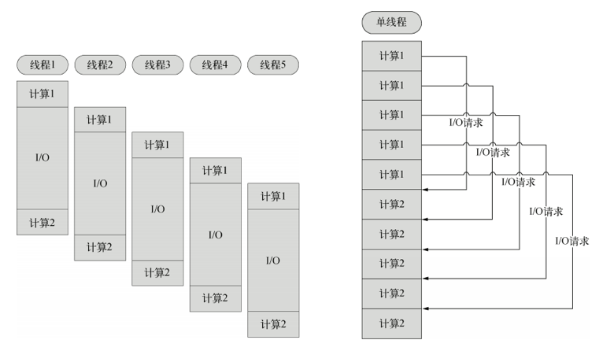

# Node.js简介
nodejs 是一个让javascript运行在服务器端的开发平台，nodejs用javascript进行编程，运行在谷歌的V8（javascript引擎）上，它自己不用建立在任何的服务器之上

## Node.js特点
1. 单线程
2. 非阻塞I/O
3. 事件驱动

### 单线程
在java，php或者.net等服务器端语言中，会为每一个客户端连接创建一个新的线程，而每一个线程消耗大概2M的内容，所以8GB的内存服务器，理论上最多只能有4000个线程。  
**Node.js不为每个客户都生成一个线程，而是只有一个线程**。通过非阻塞I/O，事件驱动机智，让Node.js程序宏观上也是并行的。使用Node.js的服务器，一个8GB的内容理论上可以同时处理4万个用户的连接  
**好处** 节省了线程创建，销毁所消耗的时间  
**坏处** 如果一个用户崩溃了，导致单线程奔溃，会影响到其他所有用户

### 非阻塞I/O
例如，当在访问数据库取得数据的时候，需要一段时间。在传统的单线程处理机制中，在执行了访问数据库代码之后，整个线程都将暂停下来，等待数据库返回结果，才能执行后面的代码。也就是说，I/O阻塞了代码的执行，极大地降低了程序的执行效率。  
由于Node.js中采用了非阻塞型I/O机制，因此在执行了访问数据库的代码之后，将立即转而执行其后面的代码，把数据库返回结果的处理代码放在回调函数中，从而提高了程序的执行效率。  
当某个I/O执行完毕时，将以事件的形式通知执行I/O操作的线程，线程执行这个事件的回调函数。为了处理异步I/O，线程必须有事件循环，不断的检查有没有未处理的事件，依次予以处理。  
阻塞模式下，一个线程只能处理一项任务，要想提高吞吐量必须通过多线程。而非阻塞模式下，一个线程永远在执行计算操作，这个线程的CPU核心利用率永远是100%。所以，这是一种特别有哲理的解决方案：与其人多，但是好多人闲着；还不如一个人玩命，往死里干活儿。

### 事件驱动
在Node中，客户端请求建立连接，提交数据等行为，会触发相应的事件。在Node中，在一个时刻，只能执行一个事件回调函数，但是在执行一个事件回调函数的中途，可以转而处理其他事件（比如，又有新用户连接了），然后返回继续执行原事件的回调函数，这种处理机制，称为“事件环”机制。  
Node.js底层是C++（V8也是C++写的）。底层代码中，近半数都用于事件队列、回调函数队列的构建。用事件驱动来完成服务器的任务调度，这是鬼才才能想到的。针尖上的舞蹈，用一个线程，担负起了处理非常多的任务的使命。

### 特点总结
说是三个特点，实际上是一个特点，离开谁都不行，都玩儿不转了。  
Node.js很像抠门的餐厅老板，只聘请1个服务员，服务很多人。结果，比很多服务员效率还高。  
Node.js中所有的I/O都是异步的，回调函数，套回调函数。

## Node.js版本管理
node有一个模块叫n（这名字可够短的。。。），是专门用来管理node.js的版本的。
首先安装n模块：
> npm install -g n   
> 或者  
> cnpm install -g n  

升级node.js到最新稳定版
> n stable

n后面也可以跟随版本号比如:
> n v0.10.26    
> 或者    
> n 0.10.26
